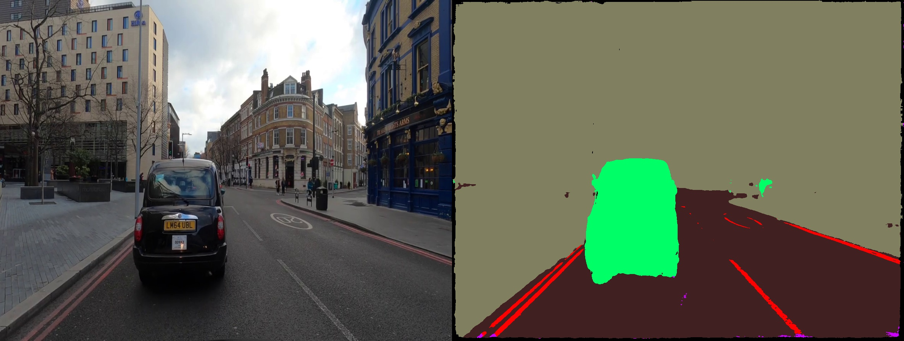

## Semantic Segmentation Model 
Demonstration of the Semantic Segmentation model trained on 10k images crowdsourced by Comma team.
This repository contains code for Semantic Segmentation Model that classifies every pixel into 5 different classes. The dataset used for training a U-Net model with efficientet encoder is https://github.com/commaai/comma10k which has no commercial or research limitations. 


The dataset is open-source and contains 10 000 labeled images. The repo https://github.com/YassineYousfi/comma10k-baseline was used for training a model, but you can easily use https://github.com/qubvel/segmentation_models.pytorch if you don't like Pyotrch Lighting. This repo is adding missing part for inferencing the model on new videos and testing the model.

The model is trained on images having the front hood of the car in the frame. That's why it is having problems with purple class when there is no vehicle front hood.

- Download pretrained model here: https://drive.google.com/drive/folders/1l7adiu4I5XWg0c5HrrEoGBh2s5DPya8_?usp=sharing

&nbsp;

<pre>
Semantic Segmentation Labels
 1 - #402020 - road (all parts, anywhere nobody would look at you funny for driving)
 2 - #ff0000 - lane markings (don't include non lane markings like turn arrows and crosswalks)
 3 - #808060 - undrivable
 4 - #00ff66 - movable (vehicles and people/animals)
 5 - #cc00ff - my car (and anything inside it, including wires, mounts, etc. No reflections)
</pre>

&nbsp;

__London Drive__





&nbsp;

__CARLA Simulator__


&nbsp;

### Installing dependencies


```
pip install -r requirements.txt
```

### Usage of the module
              

```
Usage: python inference_demo.py [OPTIONS]

Options:
  --backbone efficientnet-b4
  --height 896
  --width 1184
  (UNet models need width/height as multiple of 32)

  --video_path .\london_drive.mp4
  --weights_path .\epoch.28_val_loss.0.0439.ckpt

Command:
 $  python inference_demo.py --backbone efficientnet-b4 --height 896 --width 1184  --video_path .\london_drive.mp4 --weights_path .\epoch.28_val_loss.0.0439.ckpt

```

